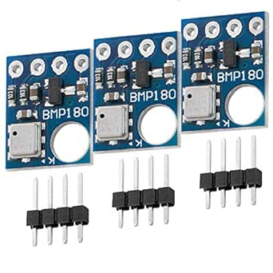

# SENSOR BMP 180(humedad/temperatura)
## introducción al sensor y librería



El BMP180 es un sensor de presión barométrica diseñado para medir la presión atmosférica y estimar la altitud sobre el nivel del mar (aunque en este código omití la parte de calcular la altura). La presión atmosférica resulta de la fuerza ejercida por la atmósfera sobre la superficie terrestre, variando con la altitud y la temperatura. En puntos más altos, la presión disminuye debido a la menor cantidad de aire. Además, la presión atmosférica se ve afectada por la temperatura, ya que esta influye en la densidad del aire, alterando su peso y, por ende, la presión.

El BMP180 mide la presión absoluta y la temperatura. Al detectar la temperatura, podemos compensar su impacto en la presión, logrando una estimación más precisa de la altitud. Este sensor se alimenta directamente desde la salida de 5V de Arduino y cuenta con un diseño compacto, bajo consumo de corriente, y componentes adicionales como un regulador de voltaje, resistencias pull-up y capacitores by-pass para mejorar su rendimiento.
| Adaptador LCD a I2C | Arduino Uno, Nano, Mini. | WROVER ESP32 |
|-----------|-----------|-----------|
| VCC | 5V | 5V |
| GND | GND | GND |
| SCL | A5 | 22 |
| SDA | A4 | 21 |

*En "Arduino Mega , DUE" los pines son 21,20 respectivamente y en Arduino Leonardo 3,2.

## CODIGO

En primer lugar, estaré utilzando la libreria hecha por Sparkfun (https://github.com/sparkfun/BMP180_Breakout/). Dicha libreria debería aparecer por defecto en el gestor de librerías de tanto el Arduino IDE como el platformio, por lo que recomiendo encarecidamente, sobretodo en platformio, de buscar la librería allí. 


Antes de empezar con el código, primero haré una introducción de los métodos que estaremos utilizando.
#### begin()
Inicializa el sensor BMP180, nos retorna 1 si la inicialización es correcta o 0 si ha fallado               

#### startTemperature()
Función para iniciar una medición de temperatura y nos retorna el tiempo en milisegundos que necesitamos esperar antes de obtener la lectura. Si nos retorna un 0, es porque ha fallado el inicio de la medición de temperatura

#### getTemperature(T)
Obtener la temperatura en la variable T, antes de usar esta función es necesario llamar a la función startTemperature() y que haya transcurrido el tiempo adecuado para la lectura; retorna 1 o 0 si la lectura se ha realizado con éxito o no respectivamente

#### startPressure();
Función para iniciar una medición de presión, hay que indicar la cantidad de muestras adicionales  (de 0 a 3) que el sensor debe tomar para la lectura de la presión y nos retorna el tiempo en milisegundos que necesitamos esperar antes de obtener la lectura. Si nos retorna un 0, es porque ha fallado el inicio de la medición de presión

#### getPressure(P, T);
Obtener el valor de la medición iniciado previamente con startPressure(); es necesario darle como parámetro la temperatura T el cual servirá para compensar la influencia de la temperatura en el cálculo de la presión, el valor de la presión absoluta se guarda en la variable P. Retorna 1 o 0 si la lectura se ha realizado con éxito o no respectivamente


En cuanto al código, es simplemente este. Ya que el sensor bmp180 no se conecta a ningún pin, el código ya está listo para su uso. Más adelante lo modificaré en funciones para cuando lo anexione al código final.

```C++
#include <SFE_BMP180.h>
#include <Wire.h>

SFE_BMP180 bmp180; //creamos el objeto de tipo SFE_BMP180

double PresionNivelMar=1013.25; //presion sobre el nivel del mar en mbar

void setup()
{
  Serial.begin(9600);

  if (bmp180.begin())
    Serial.println("BMP180 iniciado correctamente");
  else
  {
    Serial.println("Error al iniciar el BMP180");
    while(1); // bucle infinito, algo salió mal. Comprueba las conexiones.
  }
}

void loop()
{
  char status;
  double T,P;
  
  status = bmp180.startTemperature();//Inicio de lectura de temperatura
  if (status != 0)
  {   
    delay(status); //Pausa para que finalice la lectura
    status = bmp180.getTemperature(T); //Obtener la temperatura
    if (status != 0)
    {
      status = bmp180.startPressure(3);//Inicio lectura de presión
      if (status != 0)
      {        
        delay(status);//Pausa para que finalice la lectura        
        status = bmp180.getPressure(P,T);//Obtenemos la presión
        if (status != 0)
        {                  
          Serial.print("Temperatura: ");
          Serial.print(T);
          Serial.print(" *C , ");
          Serial.print("Presion: ");
          Serial.print(P);
          Serial.print(" mb , ");      
        }      
      }      
    }   
  } 
  delay(1000);
}
```

En cuanto a la explicación del código, está sustancialmente todo explicado entre la introducción de los métodos y los comentarios del código.

Igualmente puede surgir alguna duda como, "¿Por qué utiliza double para las variables?" la respuesta a esto radica en que el double tiene más precisión decimal y un abanico de valores mayor al de "float". Esto también resulta muy útil para cálculos matemáticos, los cuales de hecho utiliza en el método bmp180.getPressure(P,T). También es útil para calcular la altura, pero como he dicho, no lo puse en este código, sin embargo, si gustas añadirlo hay que declarar la variable A junto a T Y P, además, hay que poner lo siguiente:

```C++
          A= bmp180.altitude(P,PresionNivelMar);
          Serial.print("Altitud: ");
          Serial.print(A);
          Serial.println(" m s.n.m."); 
```
Este fragmento hay que colocarlo justo después de la línea de código "Serial.print(" mb , ");", entre la línea de código y el corchete.

## POSIBLES ERRORES QUE NOS LLEGUEMOS A ENCONTRAR (los que me ocurrieron)

* En primer lugar, el terminal debería mostrar un mensaje de este estilo: "Temperatura : VALOR *C, Presion: VALOR mb"


Si no lo muestra y, ocasionalmente, muestra carácteres "extraños" es posible que tengas los "baudios" a una mala calibración. 
El término "baud" se refiere a la velocidad de transmisión de datos en un canal de comunicación, como en el caso de la comunicación serie utilizada en Arduino. Se expresa en baudios (símbolos por segundo) y determina la velocidad a la que los bits de datos se envían y reciben en un canal de comunicación. Por lo general está por defecto en 9600 (o 115200), pero puede que lo tengas establecido en otro valor el cual no coincide. Para cambiarlo unicamente te diriges al monitor serial, tanto en arduino como en platformio, y allí aparecerán los baudios. 

* Error al iniciar el sensor: Probablemente se deba a que está mal conectado. Para solucionarlo controla si tienes los pines del 22 y 21 conectados a donde deben estar (si parece que sí están en el lugar adecuado, intenta igualmente intercambiarlos, a lo mejor funciona ya que a mí me funcionó de esta manera).
